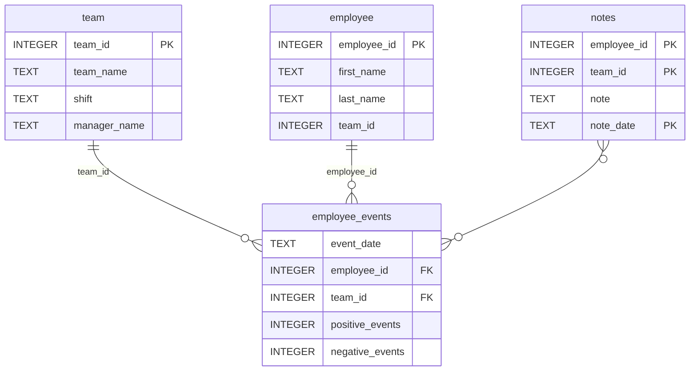

# Employee Events Report (A Data Science Dashboard Project)

A web dashboard for exploring employee performance data and the likelihood that
an employee or team will be recruited.

Data is generated as fictional but realistic employee records — 25 employees
across 5 teams, each assigned a behavioral profile that shapes how many positive
and negative events they accumulate over time. A logistic regression model is
trained on those event counts to predict recruitment.

The dashboard lets you pick an employee or a team and shows two visualizations
alongside the notes recorded against that entity:

- **Event counts over time** — cumulative positive and negative events by date
- **Predicted recruitment risk** — the model's probability for that entity,
  shown as a single bar

## How it works

`src/build_project_assets.py` generates the data, writes it to a SQLite
database, and trains the model saved in `assets/model.pkl`. The
`employee_events` Python package wraps that database in a small query API. The
`report/` directory contains a [fasthtl](https://fasthtml.com) application that
composes reusable UI components to render the dashboard.

Run it from inside `report/`:

```bash
pip install -r requirements.txt
cd report
python dashboard.py
```

Then open the URL printed at startup. The Employee/Team toggle swaps the
entity dropdown without a full page reload.

### Repository Structure
```
├── README.md
├── assets
│   ├── model.pkl
│   └── report.css
├── env
├── python-package
│   ├── employee_events
│   │   ├── __init__.py
│   │   ├── employee.py
│   │   ├── employee_events.db
│   │   ├── query_base.py
│   │   ├── sql_execution.py
│   │   └── team.py
│   ├── requirements.txt
│   ├── setup.py
├── report
│   ├── base_components
│   │   ├── __init__.py
│   │   ├── base_component.py
│   │   ├── data_table.py
│   │   ├── dropdown.py
│   │   ├── matplotlib_viz.py
│   │   └── radio.py
│   ├── combined_components
│   │   ├── __init__.py
│   │   ├── combined_component.py
│   │   └── form_group.py
│   ├── dashboard.py
│   └── utils.py
├── requirements.txt
├── start
├── tests
    └── test_employee_events.py
```

### employee_events.db


